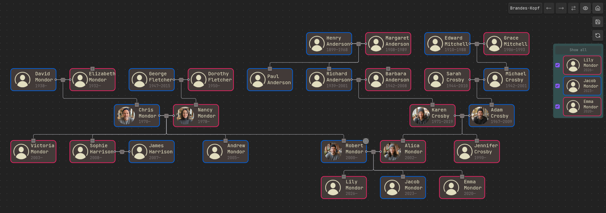
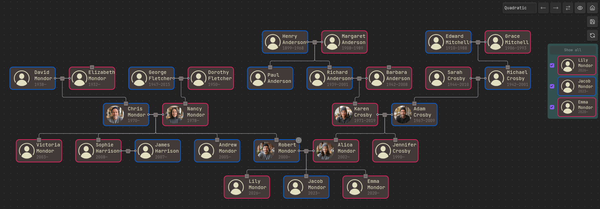
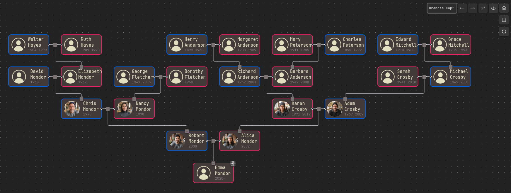
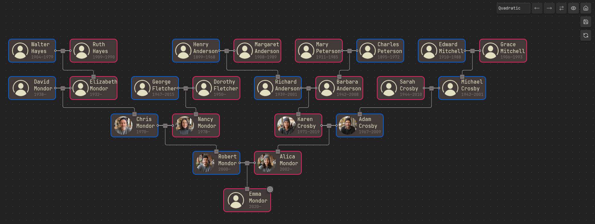
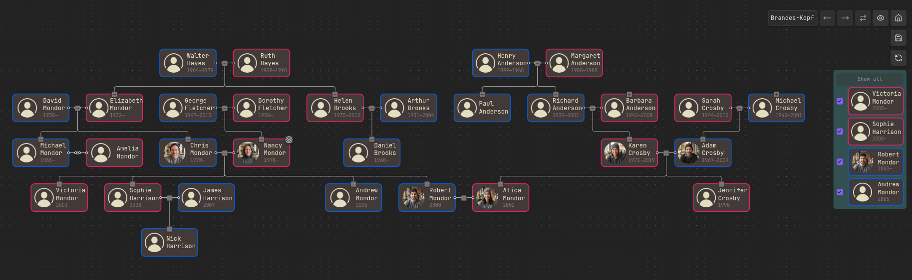
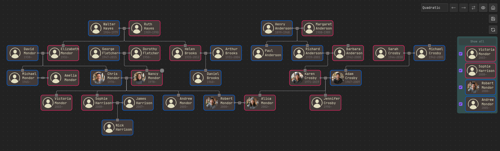

### Table of contents:

- [Grafily](#grafily)
  - [How it works](#how-it-works)
  - [Visualization](#visualization)
- [Motivation](#motivation)
- [Installation](#installation)
  - [Obsidian Community Plugins](#obsidian-community-plugins)
  - [Manual installation](#manual-installation)
- [Usage](#usage)
- [BDFL](#bdfl)
- [App philosophy](#app-philosophy)
  - [Do one thing and do it well](#do-one-thing-and-do-it-well)
  - [The Worse Is Better](#the-worse-is-better)

# Grafily

Grafily is an Obsidian plugin for rendering family graphs (family trees).
It uses the [reactflow](https://reactflow.dev/) library for rendering and a custom layout algorithm for placing graph nodes.

This plugin is useful for family history/genealogy research, tracking family members, etc.

## How it works

- The Grafily expects that your vault has one page per person.
- The Grafily scans all pages in the directory (the directory is configurable), extracts persons' metadata (see the [Usage](#usage) section for the metadata format), builds an internal relationship graph, and then renders a pretty **interactive** graph that you can easily navigate and view family members.
- An interactive UI allows you to collapse or expand family relationships with other persons (collapse/expand children/parent nodes).

Basically, Grafily is just a tool that creates a pretty graph from vault `.md` files:


```mermaid
flowchart LR
    first["bunch of .md files"] -->|Grafily| second["Pretty graph ✨"]
```

If you want to read more about how it works, please read my blog post: [Announcing Grafily v.0.3.0#how-it-works](https://tbt.qkation.com/posts/announcing-grafily-0-3/#how-it-works).

## Visualization

The plugin needs to calculate every node's `x` and `y` coordinates to render the graph.
Grafily implements two node positioning algorithms:

* **Brandes-Köpf**: This algorithm is based on the paper from 2002: [Fast and Simple Horizontal Coordinate Assignment](https://scispace.com/pdf/fast-and-simple-horizontal-coordinate-assignment-2aawem94ts.pdf).
  The current implementation is heavily inspired by [the dagre project](https://github.com/dagrejs/dagre/blob/2595d05a0fbb7721f35bfcaab5fbf40f5b3858ca/lib/position/bk.js). Basically, it uses the same algorithm, rewritten in TypeScript and adapted to the current use case.
* **Quadratic**: This algorithm calculates every node `(x; y)` using [Quadratic programming (QP)](https://en.wikipedia.org/wiki/Quadratic_programming).
  The graph nodes' aesthetic is defined by a mathematical equation.
  The algorithm tries to optimize (minimize) that function.

In practice, neither algorithm guarantees pixel-perfect centering.
In some cases, it is not even obvious how to center and move nodes so that the graph looks good.
Both algorithms produce not perfect but pretty-enough graphs.

Usually, **Quadratic** is better in most cases.
But some graphs are better with **Brandes-Köpf**.
In any case, the user can switch between them mid-work while working with the graph.

<sup><sub>All persons in the demo screenshots below are generated using AI. If you find any coincidences with real people, please contact me, and I will fix them.</sub></sup>

| Brandes-Köpf | Quadratic |
|-|-|
|  |  |
|  |  |
|  |  |

## Interactivity

The user selects a person and builds a starting graph: a simple family tree or an extended graph of relatives.
After that, the user can add more relatives to the graph or hide any persons from the graph.
The Grafily functionality allows the user to modify the resulting graph as they want.
If you want to read more about interactivity, please read my blog post: [Genealogy Graph Interactivity](https://tbt.qkation.com/posts/genealogy-graph-interactivity/).

# Motivation

I started my family research in 2025. I did not want to store all the information on a third-party site (for instance, [myheritage.com](https://myheritage.com)).
I wanted to own the private information, photos, stories, interview recordings with my relatives, and much more.

So, I decided to use [Obsidian](https://obsidian.md/). There are plenty of reasons why Obsidian:

1. I own my data.
2. Easy to use.
3. Powerful plugin API.

But there was a problem: I couldn't find a suitable plugin to render a pretty graph of family relationships.
So, I decided to write my own plugin.
Grafily has one concrete purpose: it is _**a viewer for family members' relationships**_.

Actually, I found one very interesting plugin: https://github.com/banisterious/obsidian-charted-roots. It is super powerful. Too powerful for me. When I use such complex software, I do not have a feeling that I control the process. I wanted _a simple_ plugin.
But do not get me wrong: [obsidian-charted-roots](https://github.com/banisterious/obsidian-charted-roots) is a great plugin, but it's just not for me.

# Installation

## Obsidian Community Plugins

The Grafily plugin is available in the [Obsidian Community Plugins](https://obsidian.md/help/community-plugins) list. You can install it directly from the Obsidian app. Here is a direct link to the plugin page: https://community.obsidian.md/plugins/grafily.

## Manual installation

You can install the plugin by downloading the release assets, placing them inside your Obsidian vault, and enabling it in the settings:

1. Go to the [TheBestTvarynka/grafily/releases](https://github.com/TheBestTvarynka/grafily/releases) page and download the release assets: `main.js`, `manifest.json`, and `styles.css`.
2. Place these files in the vault plugin directory:

```bash
VAULT_DIR=/path/to/vault
GRAFILY_DIR=${VAULT_DIR}/.obsidian/plugins/grafily
mkdir -p ${GRAFILY_DIR}
cp main.js ${GRAFILY_DIR}
cp styles.css ${GRAFILY_DIR}
cp manifest.json ${GRAFILY_DIR}
```

3. Enable the Grafily plugin in the Obsidian settings (`Community Plugins` section).

If you want to build the plugin from source, follow the [BUILD_FROM_SRC.md](./doc/BUILD_FROM_SRC.md) document.

# Usage

Read these two guides to understand the metadata format and how to use the plugin:

1. [METADATA.md](./doc/METADATA.md).
2. [GETTING_STARTED.md](./doc/GETTING_STARTED.md).

# BDFL

Have you heard of [BDFL](https://en.m.wikipedia.org/wiki/Benevolent_dictator_for_life)?

TL;DR:

> **Benevolent dictator for life (BDFL)** is a title given to a small number of open-source software development leaders, typically project founders who retain the final say in disputes or arguments within the community.

For the Grafily project, the BDFL is [@TheBestTvarynka (Pavlo Myroniuk)](https://github.com/TheBestTvarynka), the original creator of Grafily.

# App Philosophy

## Do one thing and do it well

Grafily has one concrete goal: to render pretty family relationship graphs.
It will never become an all-in-one genealogy research tool.
It will never become a universal graph renderer. Or anything like that.
The Grafily follows the [Unix philosophy](https://en.wikipedia.org/wiki/Unix_philosophy#Do_One_Thing_and_Do_It_Well):

> Do one thing and do it well.

The Grafily is good at building graph layouts.
It does not even render them because the [`reactflow`](https://reactflow.dev/) library handles that.

## The Worse Is Better

Did you hear about [the _worse-is-better_ philosophy](https://www.dreamsongs.com/RiseOfWorseIsBetter.html)? If not, I encourage you to read the [The Rise of Worse is Better](https://www.dreamsongs.com/RiseOfWorseIsBetter.html) article.

TL;DR. This is a citation from the article mentioned above:

> The worse-is-better philosophy:
>   - Simplicity -- the design must be simple, both in implementation and interface. It is more important for the implementation to be simple than the interface.
>   - Correctness -- the design must be correct in all observable aspects. It is slightly better to be simple than correct.
>   - Consistency -- the design must not be overly inconsistent. Consistency can be sacrificed for simplicity in some cases, but it is better to drop those parts of the design that deal with less common circumstances than to introduce either implementational complexity or inconsistency.
>   - Completeness -- the design must cover as many important situations as is practical. All reasonably expected cases should be covered. Completeness can be sacrificed in favor of any other quality. Consistency can be sacrificed to achieve completeness if simplicity is retained.

:thinking: What does it mean for the app?
It means some features can be discarded in favor of app simplicity.
The benefits of some features may not justify the complexity of their implementation.
I would rather keep the app simple than unreasonably complex.
