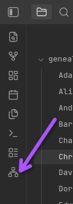
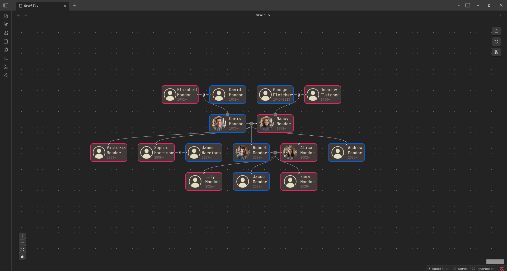
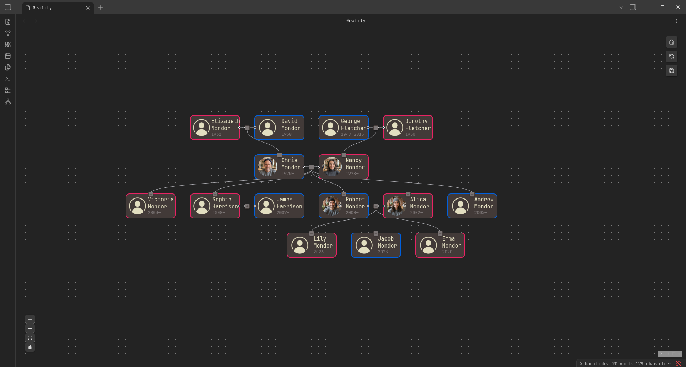
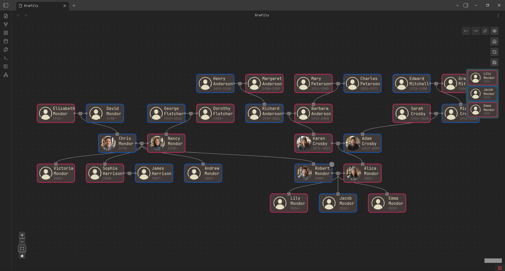

# Getting started

Before diving into it, make sure you read and understand the [Metadata](./METADATA.md) format and purpose.

- [Populate the vault](#populate-the-vault)
- [Visualize](#visualize)

## Populate the vault

First, create the `genealogy` directory at the root of the vault and specify it in the Grafily plugin settings. Next, create an `images` directory alongside the `genealogy` directory.

The next step is creating people's files. To simplify the guide, I already prepared all the needed data. You can download it here: https://github.com/TheBestTvarynka/trash-code/tree/grafily_demo/grafily_demo.

At this point, you can observe the files to understand their structure. All persons and images are AI-generated. Let's take `Chris_Mondor` as an example:

```md
# Chris Mondor

**Spouse**: [[Nancy_Mondor]]
**Birth**: 1970-12-03
**Gender**: male
**Parents**: [[David_Mondor]], [[Elizabeth_Mondor]]
**Image**: [[images/Chris_Mondor.png]]

---
```

His page contains only metadata and no additional information. The metadata contains the spouse page link, parents' links, profile image link, birth date, and gender. Nothing special. If you open any other file, you will see something like this.

When the vault is full of information, we can start visualizing it.

## Visualize

Open the grafily plugin by pressing a new button on the left panel:



You will see the start-up menu. You need to select a graph type and a starting person. That's it! Nothing more. The difference between visualization layouts is described here: https://tbt.qkation.com/posts/announcing-grafily-0-3/#layout-algorithms.

Let's build a Reingold-Tilford graph for the `Chris_Mondor`:



Next, let's compare it to the Brandes-Kopf:



Nothing special, but when you move his son `Robert_Mondor` to the right and expand the son's wife's parents, you can see the full power of this layout type:


