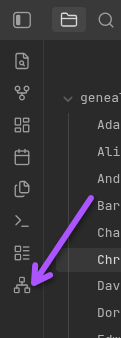

# Getting started

Before diving into it, make sure you read and understand the [Metadata](./METADATA.md) format and purpose.

- [Populate the vault](#populate-the-vault)
- [Visualize](#visualize)

## Populate the vault

First, create the `genealogy` directory at the vault root and specify it in the Grafily plugin settings. Next, create an `images` directory alongside the `genealogy` directory.

Next, create people files. To simplify the guide, I already prepared all the needed data. You can download it here: https://github.com/TheBestTvarynka/trash-code/tree/grafily_demo/grafily_demo.

At this point, you can observe the files to understand their structure. All persons and images are AI-generated. Let's take `Alica_Mondor` as an example:

```md
# Alica Mondor

**Spouse**: [[Robert_Mondor]]
**Gender**: female
**Birth**: 2002-06-02
**Image**: [[images/Alica_Mondor.png]]
**Parents**: [[Adam_Crosby]], [[Karen_Crosby]]

---

```

His page contains only metadata and no additional information.
The metadata contains the spouse page link, parents' links, profile image link, birth date, and gender. Nothing special.
If you open any other file, you will see something like this.

When the vault is full of information, we can start visualizing it.

## Visualize

Open the grafily plugin by pressing a new button on the left panel:



You will see the start-up menu.
Select a starting graph type: a tree-like graph (`Family tree`) or an extended graph of relatives (`Graph explorer`).
That's it!
Nothing more.
The difference between visualization layouts is described here: https://tbt.qkation.com/posts/announcing-grafily-0-3/#layout-algorithms.

Let's build a tree-like graph for the `Alica Mondor`:


Next, let's compare it to the `Graph explorer` starting type:


If you do not like the layout, you can change it from `quadratic` to `brandes-kopf` by clicking on the drop-down in the side panel:


