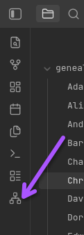

# Getting started

Before diving into it, make sure you read and understand the [Metadata](./METADATA.md) format and purpose.

- [Populate the vault](#populate-the-vault)
- [Visualize](#visualize)
- [Add a relative](#add-a-relative)

## Populate the vault

First, create the `genealogy` directory at the vault root and specify it in the Grafily plugin settings. Next, create an `images` directory alongside the `genealogy` directory.

Next, create people files. To simplify the guide, I already prepared all the needed data. You can download it here: https://github.com/TheBestTvarynka/trash-code/tree/grafily_demo/grafily_demo.

At this point, you can observe the files to understand their structure. All persons and images are AI-generated. Let's take `Alica_Mondor` as an example:

```md
# Alica Mondor

**Spouse**: [[Robert_Mondor]]
**Gender**: female
**Birth**: 2002-06-02
**Image**: [[images/Alica_Mondor.png]]
**Parents**: [[Adam_Crosby]], [[Karen_Crosby]]

---
```

His page contains only metadata and no additional information.
The metadata contains the spouse page link, parents' links, profile image link, birth date, and gender. Nothing special.
If you open any other file, you will see something like this.

When the vault is full of information, we can start visualizing it.

## Visualize

Open the grafily plugin by pressing a new button on the left panel:



You will see the start-up menu.
Select a starting graph type: a tree-like graph (`Family tree`) or an extended graph of relatives (`Graph explorer`).
That's it!
Nothing more.
The difference between visualization layouts is described here: https://tbt.qkation.com/posts/announcing-grafily-0-3/#layout-algorithms.

Let's build a tree-like graph for the `Alica Mondor`:


Next, let's compare it to the `Graph explorer` starting type:


If you do not like the layout, you can change it from `quadratic` to `brandes-kopf` by clicking on the drop-down in the side panel:


## Add a relative

Writing a person page by hand is easy to get wrong.
The Grafily plugin has a built-in person creation helper.

Select a person in the graph, then select the **user-plus** button in the side panel and pick what to add: **Add brother**, **Add sister**, **Add spouse**, **Add parents**, or **Add children**.
Grafily asks for the name, surname, parental name, and the birth and death dates - everything else is derived from the relation, so there is nothing else to fill in.
The one exception is a child's gender: nothing about the relation implies it, so the form asks, and it defaults to unknown.

On submit, Grafily creates the page in your pages directory and opens it.
It also records the new relation on every page involved: a new sibling or child is listed under both parents' **Children**, and a new spouse link is written on both pages.
Parents are always added as a pair, because a person with only one parent is not supported.

Page names follow the `<surname>_<name>_<parental name>.md` pattern. When you leave the parental name out, `???` takes its place, and when such a page already exists, a number is appended.

Some relations cannot be added, and Grafily says so instead of writing an inconsistent vault:

- A sibling needs parents to share, so add both parents first.
- A child needs both parents too, so the person must be married first.
- Only one spouse per person is supported.
- A person who already has parents cannot get a second pair.

The graph itself is not rebuilt around the new person.
Select **Refresh** and build the graph again when you want to see them in it.
