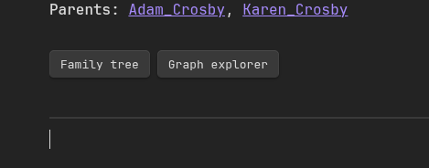

# Metadata

Grafily expects your vault to have **one page per person**. But it does not mean that all pages in the vault must be dedicated only to persons.

- Grafily will scan only pages in **the specified directory in the plugin settings**.
- Grafily will accept **only pages that include all required metadata**.

Metadata is predefined information at the start of each page. Here is a metadata template:

```md
# <surname> <name>

**Spouse**: [[<spouse page>]]
**Parents**: [[<1st parent page>]], [[<2nd parent page>]]
**Birth**: <year>-<month>-<day>
**Death**: <year>-<month>-<day>
**Image**: [[<profile picture file>]]
**Children**: [[<1st children page>]], [[<2nd children page>]], ...

---

Person's page content.
```

Example:

```md
# Myroniuk Pavlo

**Spouse**: [[Kateryna]]
**Parents**: [[Yaroslav]], [[Halyna]]
**Birth**: 2001-07-10
**Image**: [[images/TheBestTvarynka.png]]

---

Hi there 👋
```

You can type any information you want after the `---`. The `# <surname> <name>` line is required. All other key-value pairs are optional, and you can specify them in any order you want.
You can also add any other key-value pairs to the metadata you want (they will be ignored).

Moreover, you do not need to specify the spouse link for both; only one link is sufficient. For example, if you specify in Bob's metadata that his spouse is Emma, then it is not required to specify Bob in Emma's metadata.

Now that you understand the metadata format and its meaning, you are ready to follow the [Getting started](./GETTING_STARTED.md) guide to see the plugin in action.

## Shortcut buttons

It's not always convenient to build family graph from the plugin start-up menu. Often we want to _just_ build a relationships graph of the current person. In that case, the Grafily plugin supports the `grafily-navigation` code block:

````
    ```grafily-navigation
    ```
````

It will be rendered as two button for quick and easy graph building:



The left button opens the family tree of the current person (`Reingold-Tilford` layout). The right button opens the graph explorer with the starting person as the current person (`Brandes-Köpf` layout). Example:


